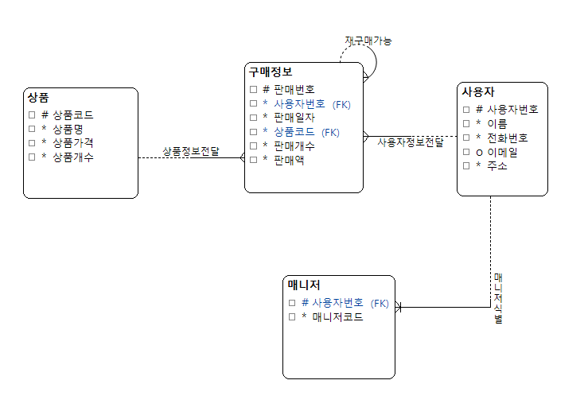
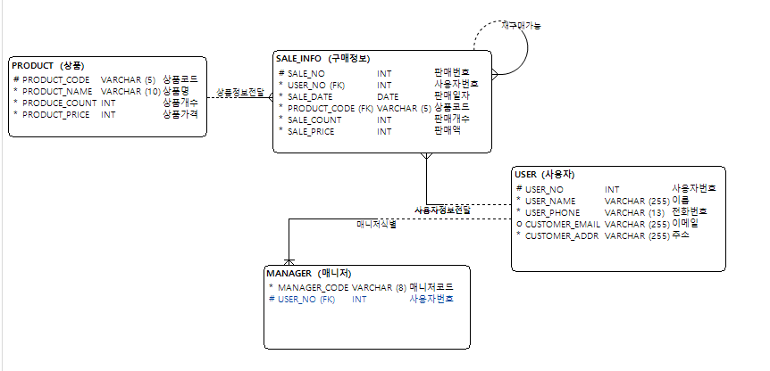

## 📖📖프로젝트 소개
______
망곰이 한정판 굿즈를 판매하는 프로그램입니다.
______
## ⌛개발기간
______
24.10.01 ~ 24.10.06
______
## 주요기능
______
##### 1. 정보입력
-이름, 전화번호, 이메일, 주소 입력  
-구매 시 정보 저장

##### 2. 판매페이지
-물품 리스트  
-구매

##### 3. 결제페이지
-고른 상품, 상품 갯수, 총액 반환  
-결제확인

##### 4. 관리자페이지
-판매량, 구매내역, 재고 등 조회  
-품목 및 재고 수정
_____  
## 데이터 모델링

______
